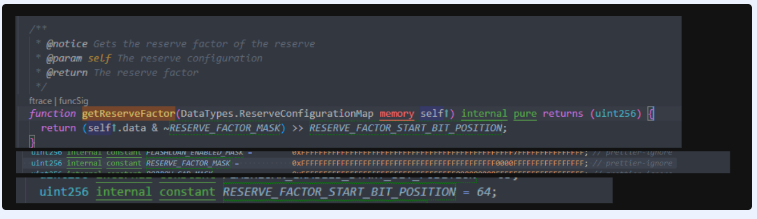
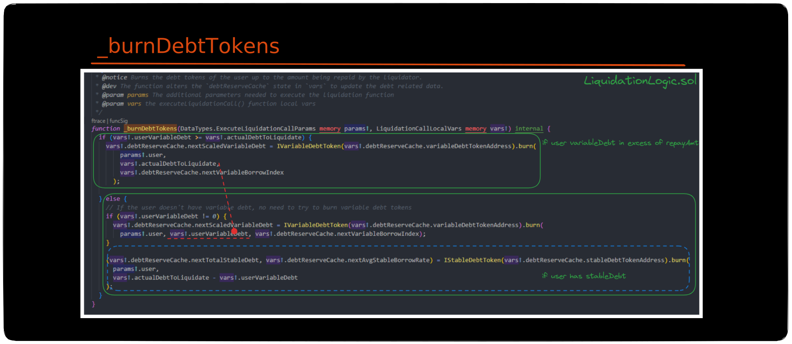

# StableDebtToken

We will examine stableDebtToken contract in this section.

## getSupplyData

<figure><figcaption><p><strong>getSupplyData</strong></p></figcaption></figure>


```solidity
(
  reserveCache.currPrincipalStableDebt,
  reserveCache.currTotalStableDebt,
  reserveCache.currAvgStableBorrowRate,
  reserveCache.stableDebtLastUpdateTimestamp
) = IStableDebtToken(reserveCache.stableDebtTokenAddress).getSupplyData();
```


### super.totalSupply()

* Inherited from IncentivizedERC20.sol

<figure><figcaption><p>IncentivizedERC20.sol</p></figcaption></figure>

* returns internal storage variable `_totalSupply`
* `_totalSupply` is incremented on `mint`, decremented on `burn`
* on borrow: `_totalSupply = _totalSupply + amount`


* Accounts for interest accrued in past periods.&#x20;
* Does not account for interest accrued since **`_totalSupplyTimestamp`**
* treated as `currPrincipalStableDebt`


### \_calcTotalSupply(avgRate)

Reflects total stable debt, where avgRate is `_avgStableRate`.

* `totalSupply = principalSupply * cumulatedInterest`
* `principalSupply is _totalSupply`

<figure><figcaption></figcaption></figure>

* calculates interest compounded from `_totalSupplyTimestamp` till now (`block.timestamp`)
* `_totalSupplyTimestamp`: Timestamp of the last update of the total supply
  * updated in `mint` & `burn`

**Why do we only calculate compound interest from `_totalSupplyTimestamp`?**

Every time `mint` or `burn` is called, `_totalSupply` is updated such that it accounts for the interest accrued since previous update till now, as well as the `mint`/`burn` amount.&#x20;

For example, at the start of `mint`

<figure><figcaption></figcaption></figure>

From this, we can see that `_totalSupply` is updated with the interest accrual from previous timestamp till now.

Since this occurs on each function call that would modify `_totalSupply`, the definition of principalStableDebt is to distinguish from accounted interest and floating, unaccounted interest.&#x20;

### \_avgStableRate

* internal storage variable
* weighted average rate, calculated across all stable borrows

<figure><figcaption></figcaption></figure>

Simply put, assume there are 3 stable borrows at differing times:

* 1: 100 DAI at 1%
* 2: 200 DAI at 2%
* 3: 300 DAI at 3%

weighted average rate = (100 \* 1%) + (200 \* 2%) + (300 \* 3%) / (100 + 200 + 300) = **2.3%**

**\_avgStableRate = 2.3%**


**ReserveCache contains the following:**&#x20;

* currPrincipalStableDebt => `super.totalSupply()`&#x20;
* currTotalStableDebt => `_calcTotalSupply(avgRate)`
* currAvgStableBorrowRate => `_avgStableRate`
* stableDebtLastUpdateTimestamp => `_totalSupplyTimestamp`

**`Also`**

* nextAvgStableBorrowRate = currTotalStableDebt&#x20;
* nexTotalStableDebt = currAvgStableBorrowRate&#x20;


## balanceOf

<figure><figcaption></figcaption></figure>

The balance for any address is calculated to account for interest accrued since the last interaction.


* each user's stable rate is stored at `_user[account].additionalData`&#x20;
* `_timestamps[account]` stores the timestamp of their last interaction


## totalSupply

returns `_calcTotalSupply(_avgStableRate)`

<figure><figcaption></figcaption></figure>

* `super.TotalSupply()` accounts for interest in all periods prior to `_totalSupplyTimestamp`
* \_calcTotalSupply will compound this with the recently accrued interest, since `_totalSupplyTimestamp` till now

## mint

Let's examine mint, from the pretext that is has been called via `executeBorrow`.

`mint` is called via the interface `IStableDebtToken`, `reserve.currentStableBorrowRate` is passed as a param.

* variable is cached to avoid unnecessary calls to storage: `currentStableRate`

<figure><figcaption></figcaption></figure>

#### **\_calculateBalanceIncrease**&#x20;

calculates the increase in balance due to compounding interest, for a specific user, since the previous &#x20;

<figure><figcaption></figcaption></figure>

#### **Update \_totalSupply**&#x20;

```solidity
vars.previousSupply = totalSupply();
vars.currentAvgStableRate = _avgStableRate;
vars.nextSupply = _totalSupply = vars.previousSupply + amount;
```

* `_totalSupply` is updated to be `previousSupply + amount`
* `previousSupply` reflects total stable debt and recently accrued interest as explained in [totalSupply](stabledebttoken.md#totalsupply)
* hence, `_totalSupply` is incremented to account for both unbooked interest and incoming borrow.

#### **Calculate nextStableRate**

`reserve.currentStableBorrowRate` is passed as `rate`.


```solidity
vars.currentStableRate = _userState[onBehalfOf].additionalData;
vars.nextStableRate = (vars.currentStableRate.rayMul(currentBalance.wadToRay()) + vars.amountInRay.rayMul(rate)).rayDiv((currentBalance + amount).wadToRay());

_userState[onBehalfOf].additionalData = vars.nextStableRate.toUint128();
```


<figure><figcaption></figcaption></figure>

* From now till the next future interaction, interest will compound at the nextStableRate.
* This is reflected in [balanceOf](stabledebttoken.md#balanceof), in **\_calculateBalanceIncrease** section.

#### **Calculate updated average stable rate**

```solidity
// Calculates the updated average stable rate
vars.currentAvgStableRate = 
_avgStableRate = (
  (vars.currentAvgStableRate.rayMul(vars.previousSupply.wadToRay()) +  rate.rayMul(vars.amountInRay)).rayDiv(vars.nextSupply.wadToRay())
).toUint128();

```

<figure><figcaption></figcaption></figure>

<figure><figcaption></figcaption></figure>

#### \_mint&#x20;

<figure><figcaption></figcaption></figure>

* increments user's balance by amount
* makes a call to \_incentivesController, should it be defined



The maximum 128-bit integer, $$2^{128}− 1$$is a number that is not usefully written out in words or in all of its 39 digits: 340282366920938463463374607431768211455

Here it is in words:

> three hundred forty undecillion, two hundred eighty-two decillion, three hundred sixty-six nonillion, nine hundred twenty octillion, nine hundred thirty-eight septillion, four hundred sixty-three sextillion, four hundred sixty-three quintillion, three hundred seventy-four quadrillion, six hundred seven trillion, four hundred thirty-one billion, seven hundred sixty-eight million, two hundred eleven thousand, four hundred fifty-five


#### Return variables

* nextSupply
* currentAvgStableRate

### Visual Aid




## Global currentStableBorrowRate and users' local borrow rate

There is a global stable rate determined by a model; each user accrues interest based on the stable rate they locked-in. How does this work?

**Held in storage, the ReserveData struct contains variable: `currentStableBorrowRate`**

* updated each time in `updateInterestRates`, via `calculateInterestRates`
* `calculateInterestRates` uses a model based on Utilization to evolve this rate.

**`currentStableBorrowRate`**

* global value
* rate for incoming stable borrows, irrespective of user

**User's stable borrow rate**

* stored in `_userState[].additionalData`
* this is his total weighted average rate, based on all his previous borrows.
  * (amount \* rate) + (amount \* rate) / totalAmount
* each time a new stable borrow is taken, this is incremented accordingly
* this is the rate at which user's interest compounds over time

**`_avgStableRate`**

* storage variable defined on `stableDebtToken` contract
* similar to how the user's rate is incremented in a weighted average fashion, this is done globally.
* incremented on ANY incoming borrows
* avg rate across ALL borrows: used to calculate total compound interest in `_accruedToTreasury`


## \_accruedToTreasury

```solidity

//calculate the stable debt until the last timestamp update
vars.cumulatedStableInterest = MathUtils.calculateCompoundedInterest(
  reserveCache.currAvgStableBorrowRate,
  reserveCache.stableDebtLastUpdateTimestamp,
  reserveCache.reserveLastUpdateTimestamp
);

//prevTotalStableDebt = currPrincipalStableDebt * cumulatedStableInterest
vars.prevTotalStableDebt = 
reserveCache.currPrincipalStableDebt.rayMul(vars.cumulatedStableInterest);

//current is stored in reserveCache
//calculated in .cache:
reserveCache.currTotalStableDebt = _calcTotalSupply(avgRate)
```

**`currTotalStableDebt = _calcTotalSupply(avgRate)`**

* accounts for interest from `_totalSupplyTimestamp` till now

**`prevTotalStableDebt`**

* accounts for interest from `stableDebtLastUpdateTimestamp` to `reserveLastUpdateTimestamp`

**Therefore,**

**`currTotalStableDebt`** - **`prevTotalStableDebt`** = interest accrued from `reserveLastUpdateTimestamp` till now.

variable is calculated from reserveCache.reserveLastUpdateTimestamp


###

